# three-tier-arch-aws-terraform
Provision three tier architecture on AWS using Terraform

## Prerequisite:
### 1. Tools Configuration 
- AWS CLI installed
- AWS configure on our local machine. 
To verify this second close, we must type the following command: 
```sh
aws configure
```
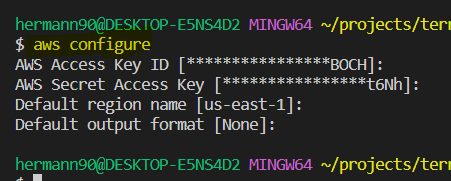

### 2. Backend configuration using S3 and DynamoDB for State file creation in aws
To realize this project, we are going to create in aws, resources, to contain the state of terraform. this allows several developers to work on the same repository so that each one can make their own changes: 

### 2.1- Creation of an S3 becket to contain the state file
1. Open the aws console
2. Click on service, then on S3
3. In the window that opens, click on create s3 
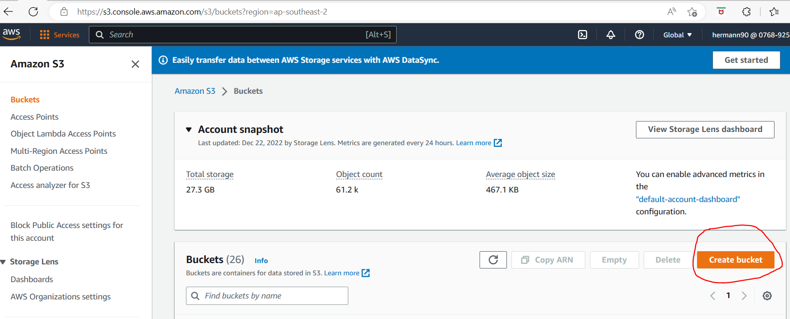

4- Fill in the form for the creation of an S3 Bucket as shown in the following image:
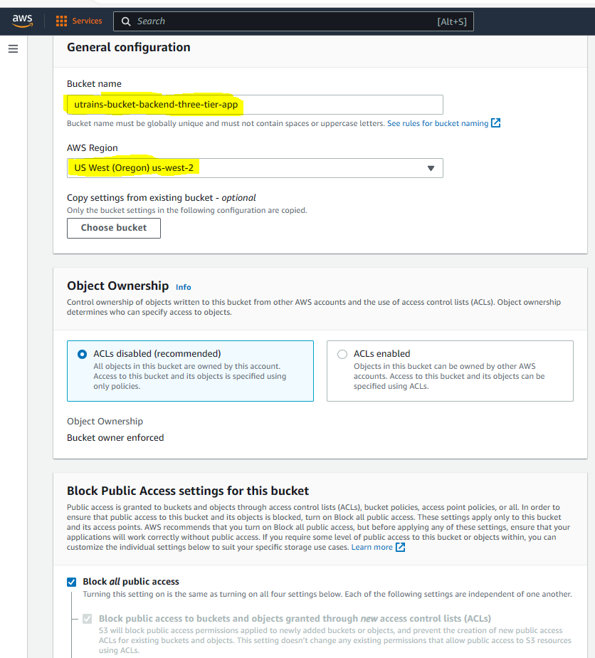 
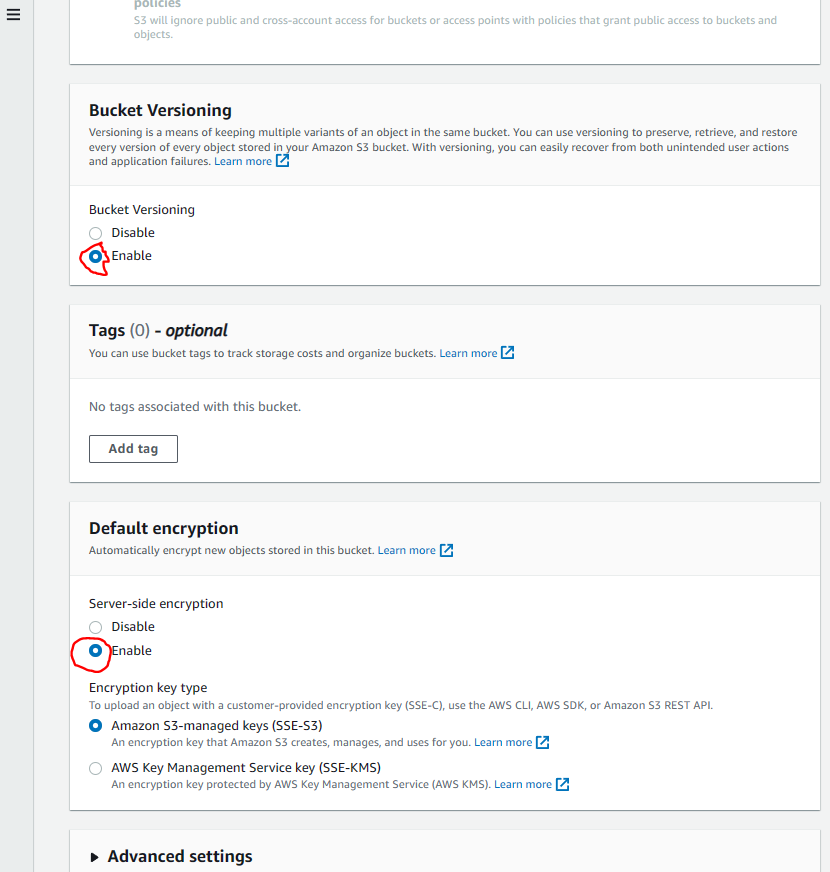

__Note :__ In my case, I used __utrains-bucket-backend-three-tier-app__ as my Bucket name. This will be used in our terraform code to configure the backend.

### 2.2- Creat table in DynamoDB
1. In the search bar of the aws console, type DynamoDB, then click on DynamoDb to select
2. In the page that appears, click on __create table__ 

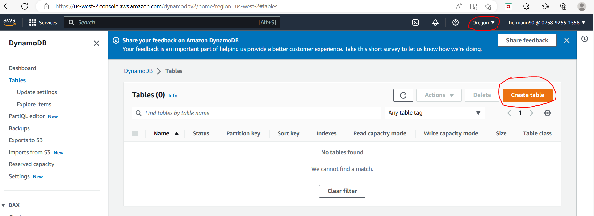

3. Fill the form by putting the name of the table (__utrains-dynamodb-backend-three-tier-app__) in my case, the partition key (__utrainsKey__). to finish, scroll down and click on create table. This no and this key will allow us to configure our backend in the Terraform code.

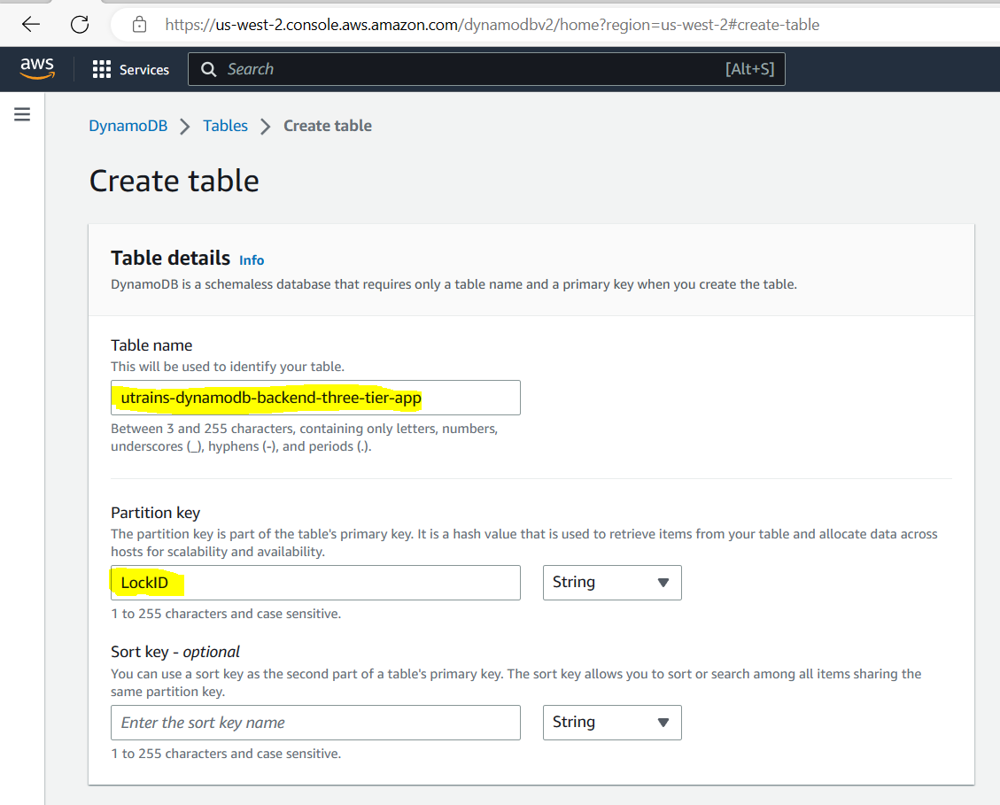

- the result of the table is as follows: 

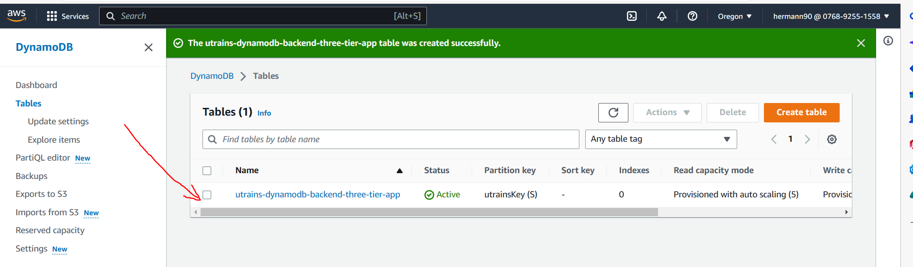

## Backend configuration
Now, let's open the __backend.tf__ file, then add the information (name of our S3 bucket creer) and the name of our dynamoDB table. 

for my case, I will have the following content: 

```sh
terraform {
  backend "s3" {
    bucket         = "utrains-bucket-backend-three-tier-app"
    encrypt        = true
    key            = "terraform.tfstate"
    region         = "us-west-2"
    dynamodb_table = "utrains-dynamodb-backend-three-tier-app"
  }
}
```

 ## Terraform orders
- Now everything is configured, we can perform the terraform commands below to create our resources in AWS, then store the state of these resources in our S3 Bucket.

```sh
terraform init
terraform plan
terraform apply -auto-approve
```

## State file in S3 Bucket
- After the creation of all the resources, we can open the aws console, go to our bucket, then consult the state file of our created infrastructure. click on __Open__ to see this file,is a JSON file


## Subnet
- Open the subnets, to see the created subnets: 

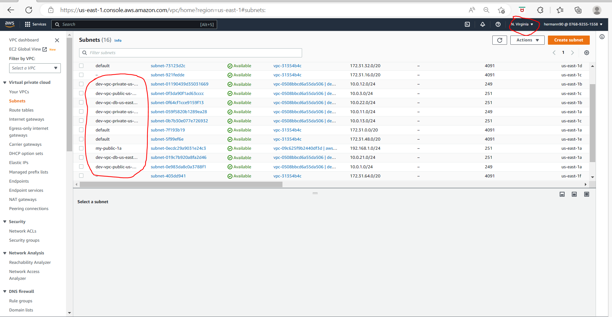


## EC2 console
- open ec2 console then see the 2 instances that is created.

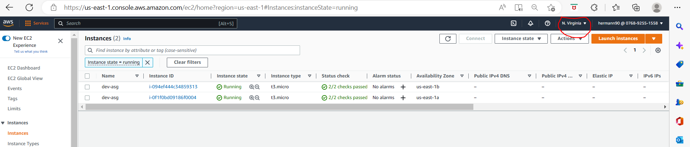

## Open the httpd 
1. go to Load balancer
2. copy the dns name, then paste in the browser. You can see that the 

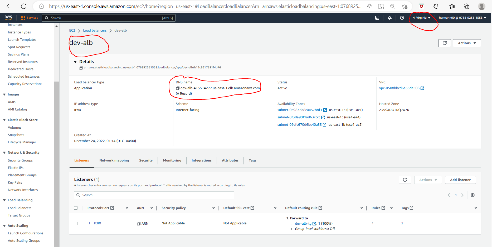

- in the browser, the apache test page can be display

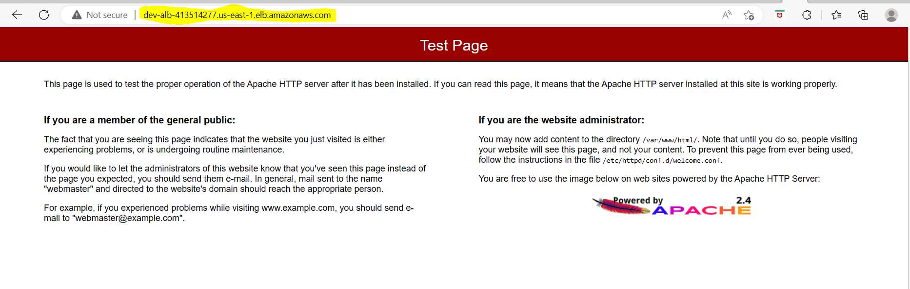

## PHP

- To see the php info page, you must add to the url of the DNS Name __/phpinfo.php__. In my case, I will have : 
 __http://dev-alb-413514277.us-east-1.elb.amazonaws.com/phpinfo.php__

- Page that we have : 

 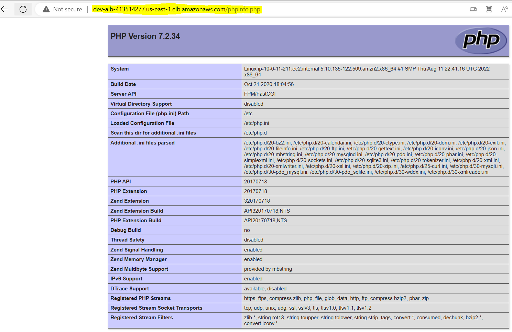

- If we refresh the browser, we can see that the name of the server changes: this is the __load balancer__

## PHP MyAdmin

- To login in to php myadmin, you must add to the url of the DNS Name __/phpMyAdmin__. In my case, I will have : 
 __http://dev-alb-413514277.us-east-1.elb.amazonaws.com/phpMyAdmin__, The login page of php MyAdmin display.

 - To get the login information, go to the terminal where the terrraform state file is located and enter the commands below: 
    - username : open the terraform.tfvars file, in line 65, you can see the __rds_username = "dev_user"__
    - password : The password is generated from terraform. To see the value of this password, enter the following command to display the output of the password.

    ```sh
    terraform output db_instance_password
    ```

    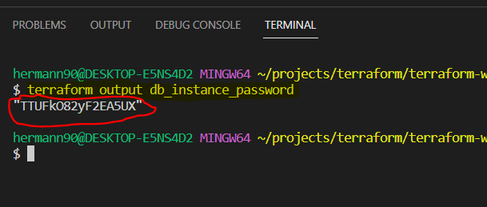

- To log into Php MyAdmin, we just need to use this password and the user name :

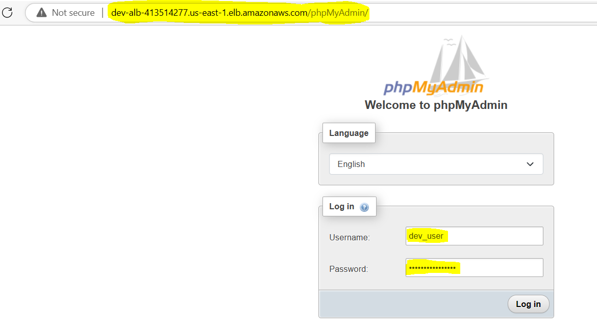

- Once logged in, we can see the php MyAdmin page, where we can create our database tables

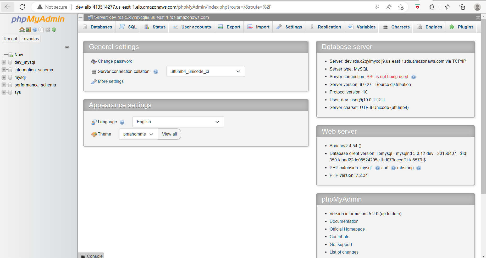

## Destroy the infrastructure.

- When we have finished testing, we can use the following command to destroy all the resources created in AWS.

```sh
terraform destroy -auto-approve
```

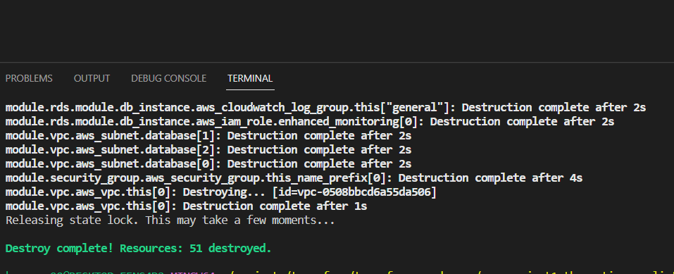

- Manually delete the S3 Bucket and DynamoDB in the AWS console
